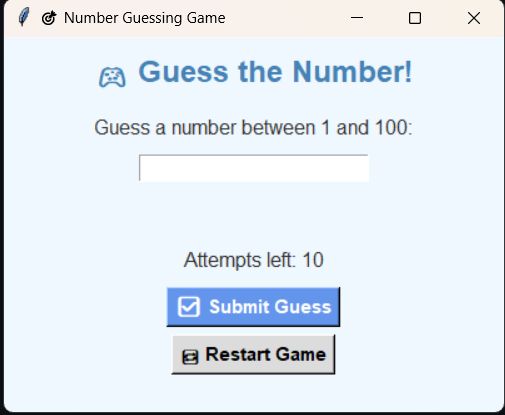
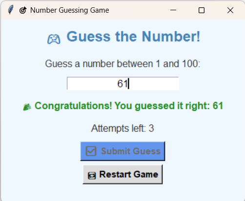

  

<h1 align="center">🎯 Crack the Code</h1>

A colorful number guessing game built with Python & Tkinter

---

## 🕹️ About the Game

🔢**Game Objective**:
- Guess the secret number between 1 and 100 in just 10 attempts! The game gives you real-time feedback: too high, too low, or correct.

🧠**Features**:
- ✔️ Beginner-friendly Python GUI
- ✔️ Colorful interface and intuitive design
- ✔️ Input validation for user-friendly error handling
- ✔️ One-click restart button
- ✔️ Smooth feedback for each guess

🛠️**Built With**:
- Python 3
- Tkinter (Standard GUI library)

---

## 🚀 ScreentShot

  
  

---

## 🎥 Demo Video

> 👇 Click below to watch how the game works:

  

---

